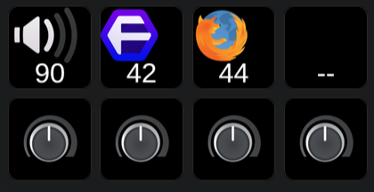
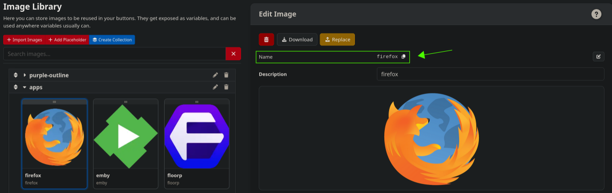
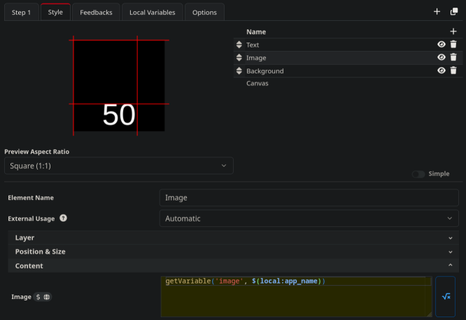
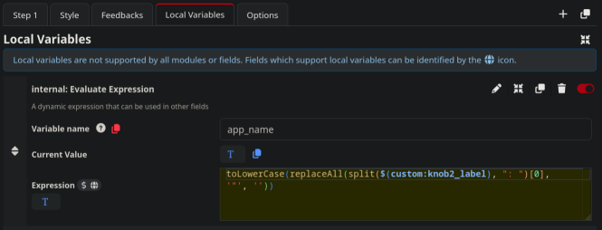

### FYI -- This program is built and tested on:
   - Bitfocus Companion BETA >= Companion: v5.0.0+9451 main-28ba9a55a8
   - OS: Linux (v7.0.11-1-cachyos; x64)

I am very actively working on this project. If you give it a try, please send me feedback! The more I know from all of you, the better it will become!  I have made a large amount of improvements on how icons are handled on 6/6/26 so make sure you're using the latest version and check frequently for updates. Thanks!

# 🎛️ Volume Monitor for BitFocus Companion


Real-time audio control at your fingertips -- finally, a volume knob that just works.

You're sitting at your computer, headphones on. A new browser tab blasts audio at 100%. You scramble for the volume control. Your Bluetooth headphones disconnected and now audio is coming out of the wrong speakers. You have three apps playing sound and no way to control them individually.

Volume Monitor fixes all of this. It connects your Linux audio system directly to your Stream Deck+, turning those beautiful knobs into intelligent, app-aware volume controls that adapt to whatever you're doing.

---

## ✨ What Makes This Different?

### 🎯 It Knows What's Playing
Volume Monitor doesn't just control "the volume" -- it sees every app making sound. Firefox playing YouTube? That's Knob 2. Spotify in the background? Knob 3. Discord call comes in? Knob 4. Each app gets its own knob, automatically. Close an app and the others shift left to fill the gap. It's like having a dedicated mixing board for your desktop.

### 🔄 Never Get Blasted Again
New app you've never opened before? It starts at 50% volume -- not 100%. No more panic-reaching for the mute button. Close an app and reopen it later? It remembers exactly where you left it. Firefox always comes back at 32% because that's where you like it. Every app remembers its own level.

### 🎧 Switch Devices Instantly
Headphones, speakers, HDMI output, Bluetooth earbuds -- Volume Monitor sees them all. Press one button on your Stream Deck (or run one command) and your audio jumps to the next device. Walking away from your desk? One tap switches from speakers to headphones. Desktop notifications confirm every switch so you always know where your audio is going.

### 🐟 Built for CachyOS, Loves All Shells
First-class Fish shell support with tab completions, handy aliases (vm, vms, vml, vmt), and automatic PATH configuration. But don't worry bash and zsh users -- it all works beautifully for you too. The installer auto-detects your shell and sets everything up.

### ⚡ Real-Time, Always
30ms polling means volume changes appear on your Stream Deck instantly. Not "pretty fast" -- instantly. Turn a physical knob on a Stream Deck+ and watch the volume change before your finger leaves the dial.

---

## 🚀 Quick Install

Fish Shell (CachyOS default):
```
  sudo pacman -S python-pipx wireplumber pipewire-pulse libnotify
  pipx ensurepath
  fish_add_path ~/.local/bin
  git clone https://github.com/Tech127x/volume-monitor.git
  cd volume-monitor
  fish install.fish
```

Bash / Zsh:
```
  sudo pacman -S python-pipx wireplumber pipewire-pulse libnotify
  pipx ensurepath
  echo 'export PATH="$HOME/.local/bin:$PATH"' >> ~/.bashrc
  source ~/.bashrc
  git clone https://github.com/Tech127x/volume-monitor.git
  cd volume-monitor
  ./install.sh
```
That's it. The installer handles everything -- pipx setup, shell configuration, Fish completions, optional systemd service, and walks you through your first configuration.

### Systemd Service (Auto-Start on Boot)
```
  scripts/install-service.sh
```

Installs a user-level systemd service that starts Volume Monitor automatically when you log in.
View logs: journalctl --user -u volume-monitor -f

---

## 🎮 Usage -- So Simple You'll Forget It's Running

  volume-monitor --start          Start in background  
  volume-monitor --status         Check if running  
  volume-monitor --list-devices   See all your audio devices  
  volume-monitor --toggle         Switch to next audio device  
  volume-monitor --list-streams   See what apps are making sound  
  volume-monitor --configure      Change any setting interactively  

  
Fish Shell Aliases:  

  vm     volume-monitor  
  vms    volume-monitor --status  
  vml    volume-monitor --list-devices  
  vmt    volume-monitor --toggle  
  vmc    volume-monitor --configure  
  vma    volume-monitor --list-streams  

---

## 📋 What You'll See On Your Stream Deck+

Knob 1 -- Master Volume
Shows your current audio device name and volume. Turn it to adjust everything. Press to mute/unmute. When you switch audio devices, the name updates automatically and you get a desktop notification.

Knobs 2-4 -- Per-App Volume (Optional)
Each knob auto-assigns to an app that's playing audio. The display shows the app name and current volume. Turn to adjust just that app. Close the app and the remaining apps shift left -- your most important stuff stays on the leftmost knobs.

Examples: Brave: YouTube, Spotify, Discord, any Steam/Proton game

Built-In Smarts:

Ghost stream protection: Brave sometimes creates temporary audio streams that disappear after 13 seconds. Volume Monitor ignores them so you never see phantom entries.

Volume memory: Close Firefox at 64% and reopen it -- it comes back at 64%. Every app remembers its level individually.

Safe defaults: Brand new apps start at 50% volume. Never get startled by a surprise 100% blast again.

---

## 🔧 Configuration

Run the friendly interactive wizard:
```
  volume-monitor --configure
```
It walks you through:  
  🔵 Bluetooth check — reminds you to connect devices before scanning  
  🔌 Companion connection — IP and port settings  
  🔔 Notifications — desktop alerts when devices switch  
  🔄 Toggle setup — pick which devices to cycle through  
  🎛️ App knobs — enable/disable, set default volume for new apps  
  📋 Companion variable guide — shows exactly which variables to create

Config is stored at ~/.volume_monitor_config.json

### Systemd Service (Optional)

  bash scripts/install-service.sh

Enables auto-start on login so Volume Monitor is always running.

---

## 🎛️ Showing App Icons on Your Stream Deck+

Volume Monitor pushes `knob2_label`, `knob3_label`, and `knob4_label` custom
variables to Companion — one per knob, each containing the name of the app
currently assigned to that knob (e.g. `"Floorp: YouTube"`, `"Spotify"`).
Use these to show dynamic app icons on your buttons.

### Method 1 (recommended) — Image Library

No module needed. Uses Companion's built-in Image Library.

**Step 1 — Add icons to the library**

1. Open Companion, go to **Connections → Image Library**
2. Upload your app icons (PNG or SVG)
3. For each icon, rename the **Name** field to match the app:
   - Brave browser → `brave`
   - Spotify → `spotify`
   - Discord → `discord`
   - Floorp → `floorp`
   (The name must be lowercase, matching what Volume Monitor extracts from the knob label.)




**Step 2 — Set up a knob button**

On any Stream Deck+ button (e.g. the button above knob 2):

1. Click **Style → Image** and enable the image field if not already present
2. Set **Content > Image** to **Expression** mode and enter:
   ```
   getVariable('image', $(local:app_name))
   ```




3. Go to **Local Variables** (button's Variables tab) and add a new entry:
   - **Local variable type:** `internal:evaluate expression`
   - **Variable name:** `app_name`
   - **Expression:** `toLowerCase(replaceAll(split($(custom:knob2_label), ": ")[0], '"', ''))`

   (Change `knob2` to `knob3` or `knob4` for other knobs.)





That's it. Companion evaluates the local variable first to extract the app
name from Volume Monitor's knob label, then looks up an image in the library
whose name matches. When Floorp plays audio, it shows the `floorp` icon.
When Spotify plays, the `spotify` icon. Add one icon to the library per app
— no feedback rules, no module, no regex configuration.

### Method 2 — Companion Module (filesystem icons)

For users who prefer to manage icon PNG files on disk instead of using the
Image Library. Requires the [companion module](companion-module-volume-monitor/).

**Step 1 — Install the module**

```bash
cp -r companion-module-volume-monitor ~/.config/companion/v5.0/modules/
cd ~/.config/companion/v5.0/modules/companion-module-volume-monitor
npm install --omit=dev
```

Then create the icon path config:

```bash
echo '{"path": "'$HOME'/.volume-monitor-icons"}' > ~/.config/companion/volume-monitor-icons-path.json
```

**Step 2 — Add icons**

Drop PNG files into `~/.volume-monitor-icons/`, named after each app.
The name must be lowercase, matching what Volume Monitor extracts from
the knob label:

```
~/.volume-monitor-icons/
├── brave.png
├── discord.png
├── floorp.png
├── spotify.png
└── ...
```

The directory is created automatically if it doesn't exist.

**Step 3 — Add the feedback to a button**

1. In Companion, add the **Volume Monitor** connection instance
2. On any button, click **Feedback → +**
3. Find the **Volume Monitor** section and select **Show app icon for Knob 2**
   (or Knob 3, or Knob 4)

The module reads `$(custom:knobX_label)`, extracts the app name, and displays
the matching PNG. Unknown apps fall back to a generic icon.

### Custom Variables (for reference)

Volume Monitor pushes these raw variables regardless of which method you use:

### Custom Variables (for custom button layouts)

Volume Monitor pushes these variables regardless of which method you use:

Knob 1 -- Master:
  knob1_label, knob1_volume, knob1_dial_pct, knob1_muted, knob1_stream_id, knob1_active

Knobs 2-4 -- Per-App (optional):
  knob2_label through knob4_label
  knob2_volume through knob4_volume
  knob2_dial_pct through knob4_dial_pct
  knob2_muted through knob4_muted
  knob2_stream_id through knob4_stream_id

---

## 📊 Requirements

  Python 3.9+, pipx, WirePlumber, pipewire-pulse, libnotify (optional)

---

## 🆘 Troubleshooting

  No devices: systemctl --user status pipewire  
  Companion won't connect: Check TCP API on port 16759  
  Volume not updating: volume-monitor --start-foreground --debug  
  Command not found (Fish): fish_add_path ~/.local/bin  
  Command not found (Bash): export PATH="$HOME/.local/bin:$PATH"

---

## 📦 Updating
```
  cd ~/volume-monitor
  git pull
  pipx install --force --editable .
  volume-monitor --start
```

## 🗑️ Uninstall

  fish uninstall.fish

## 📚 Documentation

- [Configuration Guide](docs/CONFIGURATION.md) — All settings explained
- [Usage Guide](docs/USAGE.md) — Commands and workflows
- [Troubleshooting](docs/TROUBLESHOOTING.md) — Common issues and fixes
- [CachyOS Fish Setup](docs/CACHYOS_FISH_SETUP.md) — Fish-specific install notes
- [Companion Setup](docs/COMPANION_SETUP.md) — Variable setup for Stream Deck+
- [Contributing](CONTRIBUTING.md) — How to help improve the project

## 📝 License

  MIT -- use it, modify it, share it... Just give credit!

---

Made with ❤️ for the CachyOS community, Bitfocus Companion users, and Stream Deck enthusiasts everywhere!

If you find this project useful, consider supporting my work. Thanks!

[](https://github.com/sponsors/tech127x)


## Disclaimer

THIS SOFTWARE IS PROVIDED "AS IS", WITHOUT WARRANTY OF ANY KIND, EXPRESS OR IMPLIED, INCLUDING BUT NOT LIMITED TO THE WARRANTIES OF MERCHANTABILITY, FITNESS FOR A PARTICULAR PURPOSE AND NONINFRINGEMENT. IN NO EVENT SHALL THE AUTHORS OR COPYRIGHT HOLDERS BE LIABLE FOR ANY CLAIM, DAMAGES OR OTHER LIABILITY, WHETHER IN AN ACTION OF CONTRACT, TORT OR OTHERWISE, ARISING FROM, OUT OF OR IN CONNECTION WITH THE SOFTWARE OR THE USE OR OTHER DEALINGS IN THE SOFTWARE.

**Use at your own risk.** This software interacts directly with system hardware. Please ensure you understand the implications of monitoring and potentially controlling hardware sensors. The author assumes no responsibility for any damage or data loss.
